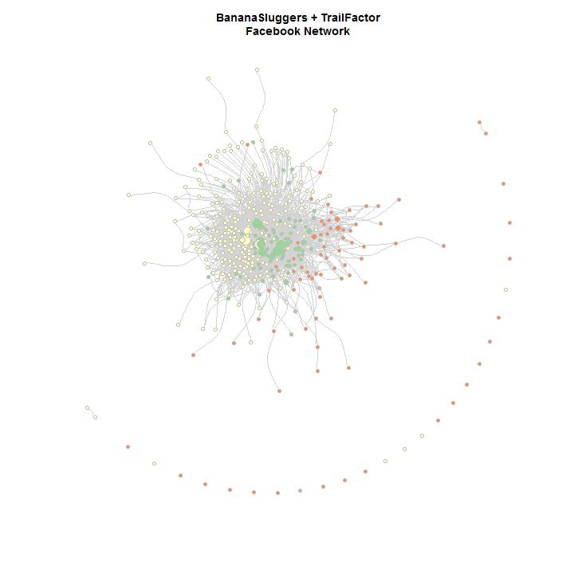

Running Group Networks
======================
Last update by Benjamin Chan (<benjamin.ks.chan@gmail.com>) on `2012-12-21 09:04:45` using `R version 2.15.2 (2012-10-26)`.

At the Pre-holiday [fat ass](http://blog.oregonlive.com/runoregon/2009/10/fat_ass_runs_in_oregon_and_sw.html) in Forest Park, December 15, 2012, I said to [Josh Owen](https://www.facebook.com/joshowen) and [Pete Savage](https://www.facebook.com/pete.savage.56) that the fat ass was a conglomeration between the BananaSluggers and the [TrailFactor](http://www.facebook.com/TrailFactor) groups; and that there's a 50-80% overlap between the two groups. I even volunteered to create a network graph of the two groups. Here it is.


Getting Facebook network data
-----------------------------
Here are the steps to getting the data from Facebook into a format for R.
* Use the [netvizz](https://apps.facebook.com/netvizz/) Facebook app to create GDF files for both the BananaSluggers and the TrailFactor friend connections (note, netvizz required many attempts and patience; after a couple of days of attempts it finally produced the GDF files)
* Use [Gephi](https://gephi.org/) to open the GDF file for the BananaSluggers group
* Create a boolean column, `GroupBananaSlugger`, indicating BananaSlugger membership
* Export the revised graph in GEXF format
* Use [Gephi](https://gephi.org/) to open the GDF file for the TrailFactor group
* Create a boolean column, `GroupTrailFactor`, indicating TrailFactor membership
* Export the revised graph in GEXF format
* Start a new Gephi project
* First open the BananaSlugger GEXF graph
* Next, open the TrailFactor GEXF graph, but use the *Append Graph* option instead of the New Graph option
* Export the graph to GML format

There's probably a way to get around using Gephi but I'm not sure if igraph, or some other SNA package, can merge two graphs.


Load required packages.

```r
require(igraph, quietly = TRUE)
require(ggplot2, quietly = TRUE)
require(xtable, quietly = TRUE)
require(RColorBrewer, quietly = TRUE)
```


```r
G <- read.graph(file = "BananaSluggersTrailFactor.gml", format = "gml")
```

There are `409` nodes and `3284` edges.

Create first name and initials vectors from names. I'll want to use these to label nodes when plotting the network.

```r
listName <- strsplit(V(G)$label, " ")
nameF <- sapply(listName, head, 1)
nameL <- sapply(listName, tail, 1)
label <- nameF
df <- data.frame(nameF, nameL)
```


Analysis questions
------------------
I'm interested in the following questions
* What is the magnitude of the overlap of BananaSluggers and TrailFactor?
* Who are the key people in the combined network?


Overlap of both groups
----------------------
Create logical vectors for group membership.

```r
grpBS <- as.logical(V(G)$GroupBananaSluggers)
grpBS[is.na(grpBS)] <- FALSE
grpTF <- as.logical(V(G)$GroupTrailFactor)
grpTF[is.na(grpTF)] <- FALSE
```

Create a factor for group membership and add to the data frame.

```r
group <- rep(NA, length(label))
group[grpBS & !grpTF] <- "BS"
group[!grpBS & grpTF] <- "TF"
group[grpBS & grpTF] <- "BS+TF"
group <- factor(group)
df <- data.frame(df, group)
```

Display the group membership totals.

```r
t <- table(df$group)
t
```

```
## 
##    BS BS+TF    TF 
##   242    84    83
```

`21`% of the nodes are in both groups.


Centrality
----------
Here's a link to [Wikipedia](http://en.wikipedia.org/wiki/Centrality) for some background information on centrality.

Calculate **degree** centrality. This ends up not being too useful. Degree is really just a measure of how connected someone is. In Facebook terms, it's who has the most friends within the BS+TF network.

```r
deg <- degree(G)
summary(deg)
```

```
##    Min. 1st Qu.  Median    Mean 3rd Qu.    Max. 
##     0.0     3.0     9.0    16.1    22.0   293.0
```

The median degree, or number of friends, was `9`. The highest number of friends a person in the BS+TF network has was `293`.

Even though I don't want to focus on degree centrality, let's see who are the most connected people in the BS+TF network.

```r
lim <- sort(deg, decreasing = TRUE)[round(vcount(G) * 0.05)]
top <- data.frame(Name = V(G)$label, Group = group, Degree = deg)
top <- subset(top, deg >= lim)
top <- top[order(top$Degree, decreasing = TRUE), ]
print(xtable(top, digits = 0), type = "html", include.rownames = FALSE)
```

<!-- html table generated in R 2.15.2 by xtable 1.7-0 package -->
<!-- Fri Dec 21 09:04:46 2012 -->
<TABLE border=1>
<TR> <TH> Name </TH> <TH> Group </TH> <TH> Degree </TH>  </TR>
  <TR> <TD> Charles Replogle </TD> <TD> BS+TF </TD> <TD align="right"> 293 </TD> </TR>
  <TR> <TD> Glenn Tachiyama </TD> <TD> BS </TD> <TD align="right"> 132 </TD> </TR>
  <TR> <TD> Yassine Diboun </TD> <TD> BS </TD> <TD align="right"> 132 </TD> </TR>
  <TR> <TD> Todd Janssen </TD> <TD> BS+TF </TD> <TD align="right"> 105 </TD> </TR>
  <TR> <TD> Amy Sproston </TD> <TD> BS+TF </TD> <TD align="right"> 97 </TD> </TR>
  <TR> <TD> Jeannie Horton </TD> <TD> BS </TD> <TD align="right"> 93 </TD> </TR>
  <TR> <TD> Anne Crispino-Taylor </TD> <TD> BS+TF </TD> <TD align="right"> 86 </TD> </TR>
  <TR> <TD> Cheri Redwine </TD> <TD> BS+TF </TD> <TD align="right"> 81 </TD> </TR>
  <TR> <TD> James Varner </TD> <TD> BS </TD> <TD align="right"> 80 </TD> </TR>
  <TR> <TD> Julie Thomas </TD> <TD> BS+TF </TD> <TD align="right"> 79 </TD> </TR>
  <TR> <TD> Renee Seker </TD> <TD> BS+TF </TD> <TD align="right"> 67 </TD> </TR>
  <TR> <TD> Meghan Canfield Arbogast </TD> <TD> BS </TD> <TD align="right"> 64 </TD> </TR>
  <TR> <TD> Terry Sentinella </TD> <TD> BS </TD> <TD align="right"> 61 </TD> </TR>
  <TR> <TD> Jason Leman </TD> <TD> BS+TF </TD> <TD align="right"> 61 </TD> </TR>
  <TR> <TD> Randy Benthin </TD> <TD> BS+TF </TD> <TD align="right"> 60 </TD> </TR>
  <TR> <TD> Craig Thornley </TD> <TD> BS </TD> <TD align="right"> 59 </TD> </TR>
  <TR> <TD> Mike Davis </TD> <TD> BS+TF </TD> <TD align="right"> 58 </TD> </TR>
  <TR> <TD> Craig Dickson </TD> <TD> BS </TD> <TD align="right"> 57 </TD> </TR>
  <TR> <TD> Willie McBride </TD> <TD> BS </TD> <TD align="right"> 56 </TD> </TR>
  <TR> <TD> MaxScott King </TD> <TD> BS </TD> <TD align="right"> 54 </TD> </TR>
   </TABLE>


Calculate **closeness** centrality. Closeness is a measure of how many steps are required to access every other node. It's a measure of how close a node is to all the action. A person with high closeness, however, doesn't necessarily have to have very many friends or be in between relationship.

```r
close <- closeness(G)
summary(close)
```

```
##     Min.  1st Qu.   Median     Mean  3rd Qu.     Max. 
## 5.99e-06 8.07e-05 8.14e-05 7.60e-05 8.16e-05 8.39e-05
```

Again, I don't want to focus on closeness centrality since it's not really what I'm after in this analysis, so I won't say anything more about it.

Calculate **betweenness** centrality. Betweenness is a measure of how often a node is in the pathway between two other nodes. I.e., a person with high betweenness can be a key player in introducing a large group of friends to another large group of friends. Such a person doesn't necessarily have to have a large number of friends themselves. But they could be in a unique position of influence in the network.

Summarize the betweenness scores. 

```r
btwn <- betweenness(G)
summary(btwn)
```

```
##    Min. 1st Qu.  Median    Mean 3rd Qu.    Max. 
##       0       0      10     227      80   39300
```

The absolute value of the scores don't mean much. But their relative values tell the story. List the top 5% of people with the highest betweeness scores.

```r
lim <- sort(btwn, decreasing = TRUE)[round(vcount(G) * 0.05)]
top <- data.frame(Name = V(G)$label, Group = group, Betweenness = btwn)
top <- subset(top, btwn >= lim)
top <- top[order(top$Betweenness, decreasing = TRUE), ]
print(xtable(top, digits = 0), type = "html", include.rownames = FALSE)
```

<!-- html table generated in R 2.15.2 by xtable 1.7-0 package -->
<!-- Fri Dec 21 09:04:47 2012 -->
<TABLE border=1>
<TR> <TH> Name </TH> <TH> Group </TH> <TH> Betweenness </TH>  </TR>
  <TR> <TD> Charles Replogle </TD> <TD> BS+TF </TD> <TD align="right"> 39346 </TD> </TR>
  <TR> <TD> Todd Janssen </TD> <TD> BS+TF </TD> <TD align="right"> 3351 </TD> </TR>
  <TR> <TD> Yassine Diboun </TD> <TD> BS </TD> <TD align="right"> 3051 </TD> </TR>
  <TR> <TD> Glenn Tachiyama </TD> <TD> BS </TD> <TD align="right"> 2796 </TD> </TR>
  <TR> <TD> Julie Thomas </TD> <TD> BS+TF </TD> <TD align="right"> 1970 </TD> </TR>
  <TR> <TD> Jeannie Horton </TD> <TD> BS </TD> <TD align="right"> 1880 </TD> </TR>
  <TR> <TD> Anne Crispino-Taylor </TD> <TD> BS+TF </TD> <TD align="right"> 1602 </TD> </TR>
  <TR> <TD> Amy Sproston </TD> <TD> BS+TF </TD> <TD align="right"> 1554 </TD> </TR>
  <TR> <TD> Cheri Redwine </TD> <TD> BS+TF </TD> <TD align="right"> 1357 </TD> </TR>
  <TR> <TD> Mallory Tyler </TD> <TD> TF </TD> <TD align="right"> 1086 </TD> </TR>
  <TR> <TD> Renee Seker </TD> <TD> BS+TF </TD> <TD align="right"> 1051 </TD> </TR>
  <TR> <TD> Cheryl Myers Willson </TD> <TD> BS+TF </TD> <TD align="right"> 1043 </TD> </TR>
  <TR> <TD> Jason Leman </TD> <TD> BS+TF </TD> <TD align="right"> 967 </TD> </TR>
  <TR> <TD> D.j. DeAustria </TD> <TD> BS+TF </TD> <TD align="right"> 871 </TD> </TR>
  <TR> <TD> James Varner </TD> <TD> BS </TD> <TD align="right"> 851 </TD> </TR>
  <TR> <TD> Mike Davis </TD> <TD> BS+TF </TD> <TD align="right"> 833 </TD> </TR>
  <TR> <TD> Jessi Lyn Bostad </TD> <TD> TF </TD> <TD align="right"> 825 </TD> </TR>
  <TR> <TD> Paul Nelson </TD> <TD> BS+TF </TD> <TD align="right"> 825 </TD> </TR>
  <TR> <TD> James Williams </TD> <TD> BS+TF </TD> <TD align="right"> 771 </TD> </TR>
  <TR> <TD> David Sobolik </TD> <TD> BS+TF </TD> <TD align="right"> 759 </TD> </TR>
   </TABLE>


Plot the association between degree centrality and betweenness centrality. See if there are any highly influential people (betweenness) who also have a high number of friends (degree).

```r
rsq <- format(cor(deg, btwn)^2, digits = 3)
cntrl <- data.frame(deg, btwn, close)
xlab <- mean(c(min(cntrl$deg), max(cntrl$deg)))
ylab <- mean(c(min(cntrl$btwn), max(cntrl$btwn)))
ggplot(cntrl, aes(x = deg, y = btwn)) + geom_jitter(alpha = 1/2) + scale_x_log10() + 
    scale_y_log10() + labs(x = "Degree", y = "Betweenness") + annotate("text", 
    label = paste("R-sq =", rsq), x = xlab, y = log(ylab))
```

 


**NEED TO EDIT**
Visualize the network
---------------------
Label the nodes with high betweenness centrality.

```r
topnodes <- nameF
topnodes[btwn < lim] <- NA
```

Scale the size of a node's plotting symbol according to its betweenness centrality score. Scaling is by percentile (95%, 98%, 99%).

```r
q <- quantile(btwn, probs = c(0, 0.95, 0.98, 0.99, 1))
size <- cut(btwn, breaks = q, include.lowest = TRUE, dig.lab = 5)
summary(size)
```

```
##      [0,691.06] (691.06,1313.4] (1313.4,1962.8]  (1962.8,39346] 
##             388              12               4               5
```

```r
V(G)$size <- unclass(size) + 1
# V(G)$size <- 1
```


Plot the network and color-code the groups.

```r
n <- nlevels(df$group)
palette <- brewer.pal(n, "Spectral")
V(G)$color[group == "BS"] <- palette[2]
V(G)$color[group == "TF"] <- palette[1]
V(G)$color[group == "BS+TF"] <- palette[3]
title <- paste("BananaSluggers + TrailFactor", "Facebook Network", sep = "\n")
plot(G, main = title, vertex.label = NA, vertex.label.color = "black", vertex.label.dist = 0.5, 
    vertex.label.family = "sans", vertex.frame.color = "gray", edge.color = "lightgray", 
    edge.curved = TRUE, )
```

 


Whoa! That's a pretty intense network graph. Let's prune it a bit and only show the runners with high degree.

```r
p <- 75
cutoff <- quantile(deg, p/100)
drop <- deg < cutoff
G <- delete.vertices(G, drop)
topnodes <- topnodes[!drop]
group <- group[!drop]
V(G)$size <- unclass(size[!drop]) + 1
```

Plot runners in the top `25`% in terms of degree. I.e., nodes with degree > `22`.

```r
subtitle <- paste("Members with degree = ", format(cutoff, digits = 4), " (", 
    p, "th percentile)", sep = "")
title <- paste(title, subtitle, sep = "\n")
plot(G, main = title, vertex.label = topnodes, vertex.label.color = "black", 
    vertex.label.dist = 0.5, vertex.label.family = "sans", vertex.frame.color = "gray", 
    edge.color = "lightgray", edge.curved = T)
```

 

